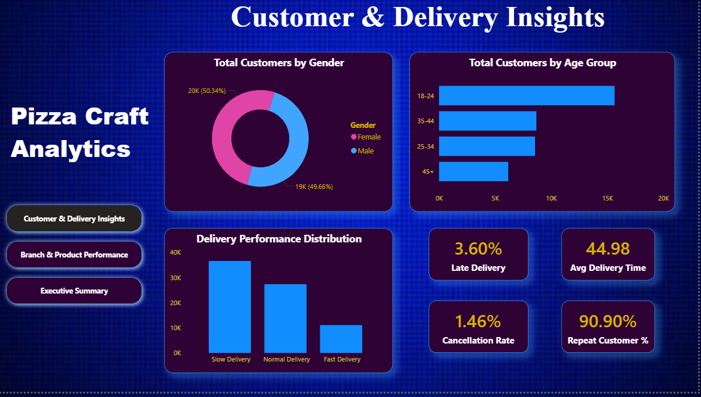

# 🍕 Pizza Sales & Customer Analytics Dashboard

## 📊 Project Overview
This project focuses on analyzing pizza sales data using Power BI to extract business insights related to revenue, profit, customer behavior, and delivery performance.

## 🔧 Tools Used
- Power BI
- Excel / CSV
- DAX

## 📸 Dashboard Preview

## 📈 Key Insights
- Revenue and profit trends over time
- Top-performing pizzas and branches
- Customer demographics analysis
- Delivery performance evaluation

## 📁 Files Included
- Power BI Dashboard (.pbix)
- Dataset
- Screenshots
